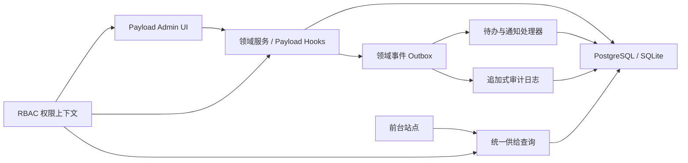
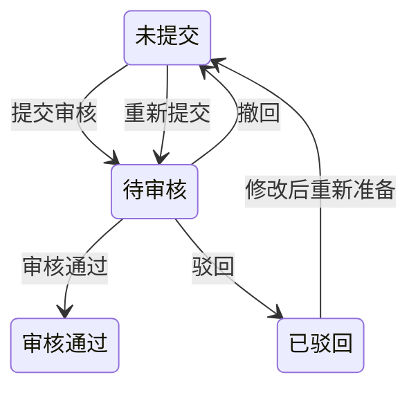

# 商办租赁后台 MVP — 技术设计

## 1. 设计目标

在保留 Payload CMS 原生表单、权限、Local API 和管理后台扩展能力的前提下，将当前基础 CRUD 演进为具备以下能力的业务后台：

- 可信供给：楼盘、商户、房源审核与显式发布共同决定前台可见性。
- 可管理线索：客户去重、线索分配、认领、公海、跟进和 SLA 形成闭环。
- 权限隔离：菜单、操作、数据和字段四层权限在服务端统一执行。
- 可追溯：状态变更、敏感读取和批量操作具备不可变审计记录。
- 口径一致：工作台、看板、列表下钻和前台查询复用统一查询策略。

## 2. 架构边界



### 2.1 模块划分

| 模块 | 职责 |
|---|---|
| Identity | 账号、角色、会话、城市与团队绑定 |
| Geography | 城市、行政区、商圈、线路、站点及商圈扩展 |
| Supply | 商户、资质、楼盘、房源、媒体、有效供给判断 |
| Review | 房源审核任务、不可变快照和审核记录 |
| Report | 房源举报、证据、处理阶段和可见性暂停 |
| CRM | 客户、线索、归属、跟进、推荐、公海和 SLA |
| Workflow | 待办、站内通知、扫描任务和事件消费 |
| Analytics | 指标定义、查询上下文、工作台和分析页面 |
| Audit | 追加式操作日志、敏感读取日志和导出日志 |

### 2.2 实现原则

- Collection hooks 只负责边界校验和调用领域服务，不承载长事务逻辑。
- 业务状态变更通过领域服务执行，禁止后台组件直接拼装多对象写入。
- 所有外部可见查询通过统一服务函数，禁止前台、Dashboard 和列表各写一套条件。
- 关键跨对象副作用使用事务内 Outbox 事件，后台任务幂等消费。
- PostgreSQL 使用数据库约束保证唯一性和有效期不重叠；SQLite 测试使用等价应用校验。

## 3. 数据模型

### 3.1 身份与权限

#### `users`

扩展现有用户：

- `name`
- `phone_normalized`
- `login_name`
- `status`: `active | disabled | locked`
- `roles`: hasMany → `roles`
- `city_scope`: hasMany → `locations`
- `team`: relationship → `teams`
- `failed_login_count`
- `locked_until`
- `session_version`

#### `roles`

- `code`：不可变；内置角色固定五个
- `name`
- `is_builtin`
- `status`
- `menu_permissions[]`
- `operation_permissions[]`
- `data_scope_rules`
- `field_permissions[]`

权限最终结果：

- 菜单、操作、字段权限采用允许并集。
- 数据范围采用业务域允许集合并集。
- 账号城市绑定作为最终上限，不允许角色扩大。

### 3.2 地理主数据

将当前 `locations` 扩展为统一节点：

- `immutable_code`
- `type`: `city | district | business_area | metro_line | metro_station`
- `parent`
- `status`
- `frontend_visible`
- `center_latitude / center_longitude`
- `sort_order`
- `version`

新增 `business_area_extensions`：

- `business_area`
- `boundary_geojson`
- `extended_center`
- `aliases[]`
- `metro_stations[]`
- `version`

基础节点只能由城市区域页面修改；商圈扩展页面不得修改基础字段。

### 3.3 商户与组织

#### `merchants`

- `name`
- `type`: 固定 `OWNER | AGENCY | FLEX_OFFICE_BRAND | CHANNEL`
- `contact_name / contact_phone`
- `service_cities[]`
- `status`
- `qualification_status`
- `qualification_expires_at`

#### `teams`

- `name`
- `manager`
- `city_scope[]`
- `status`

#### `brokers`

建议使用独立业务档案并关联 `users`：

- `user`
- `team`
- `service_cities[]`
- `service_business_areas[]`
- `employment_status`

#### 供给关系

- `building_merchant_relations`
- `listing_merchant_relations`

公共字段：

- 对象 ID
- `merchant`
- `effective_from`
- `effective_to`
- `created_reason`
- `version`

生产 PostgreSQL 使用 exclusion constraint 防止同一对象有效期重叠。

### 3.4 楼盘和房源

#### `buildings`

保留现有数据并补充：

- `city`
- `status`: `active | disabled`
- `building_type / grade`
- `completion_date`
- `total_floors`
- `property_company / property_fee`
- `parking_spaces`
- `registration_capability`
- `verification_status`
- `recommended_order`
- `version`

#### `listings`

将当前混合 `status` 拆分为：

- `publication_status`: `draft | published | unpublished | leased`
- `review_status`: `not_submitted | pending | approved | rejected`
- `supply_visibility_hold`: `normal | pending_recheck`
- `availability_status`
- `business_type`: `lease | sale`
- `decoration_status`
- `floor`
- `minimum_lease_months`
- `payment_terms`
- `contact_broker`
- `gallery[]`
- `floor_plans[]`
- `display_tags[]`
- `last_effective_maintained_at`
- `version`

价格使用结构化字段，禁止仅保存展示文本：

- `amount`
- `currency`
- `billing_period`
- `unit`

### 3.5 审核和举报

#### `listing_reviews`

- `listing`
- `snapshot`
- `snapshot_hash`
- `task_status`
- `decision`
- `reason`
- `submitted_by / reviewed_by`
- `submitted_at / reviewed_at`
- `listing_version`

审核记录不可修改或物理删除。

#### `listing_reports`

- `listing`
- `reporter_context`
- `reason_code`
- `description`
- `evidence[]`
- `status`
- `processing_stage_version`
- `assignee`
- `resolution`
- `resolution_reason`

### 3.6 CRM

#### `customers`

- `name`
- `phone_normalized`
- `phone_masked_snapshot`
- `company`
- `status`

手机号用于查重但不作为业务主键。

#### `leads`

将当前简化线索迁移为：

- `customer`
- `source_channel`
- `effective_created_at`
- `effective_source_channel`
- `stage`: `new | pending_assignment | following | qualified | viewing | negotiation | converted | lost`
- `ownership_status`: `unassigned | assigned | public_pool`
- `owner`
- `team`
- `city`
- `districts[] / business_areas[]`
- `area_min / area_max`
- `budget_min / budget_max / currency / billing_period`
- `seat_count`
- `move_in_date`
- `lease_months`
- `special_requirements`
- `first_valid_follow_up_at`
- `last_valid_follow_up_at`
- `next_follow_up_at`
- `runtime_policy_version`
- SLA 秒数字段快照
- `version`

#### `lead_ownership_history`

记录分配、认领、转派、进入公海和回收，不覆盖历史归属。

#### `follow_ups`

- `lead`
- `broker`
- `method`
- `result`
- `content`
- `next_follow_up_at`
- `related_listings[]`
- `correction_of`
- `created_at`

跟进记录不可物理删除；24 小时纠错通过追加修正记录实现。

### 3.7 工作流与审计

#### `tasks`

- `type`
- `source_collection / source_id / source_version`
- `assignee / team`
- `priority`
- `status`
- `due_at`
- `completion_event_id`
- `cancellation_reason`

幂等键：`task_type + source_id + source_version`。

#### `domain_events`

事务 Outbox：

- `event_id`
- `event_type`
- `aggregate_type / aggregate_id / aggregate_version`
- `payload`
- `occurred_at`
- `processed_at`
- `attempt_count`

#### `audit_logs`

- 操作主体和角色/组织快照
- 动作、对象、对象版本
- 脱敏前后值
- 请求 ID、IP、设备
- 结果和失败原因
- UTC 时间
- 校验和

只允许追加和读取，不开放 update/delete API。

## 4. 核心状态机

### 4.1 房源



发布状态独立流转：

```text
草稿 → 已上架 → 已下架
草稿/已下架 → 已上架（要求审核通过且满足有效供给谓词）
草稿/已上架/已下架 → 已出租
```

审核通过不得隐式上架。

### 4.2 线索

```text
新建 → 待分配 → 跟进中 → 有效商机 → 带看 → 谈判 → 已转化
任意非终态 → 已流失
```

公海属于归属状态，不属于线索阶段。

### 4.3 待办

```text
待处理 → 处理中 → 已完成
待处理/处理中 → 已取消
```

逾期是计算属性，不新增持久化状态。

## 5. 统一有效供给查询

新增 `getEffectiveSupplyWhere(asOf, permissionContext)`，供以下位置复用：

- 前台列表和详情
- 楼盘聚合
- 实时预览
- 跟进关联房源候选
- 工作台及数据看板

必要条件：

1. Listing 未逻辑删除。
2. 发布状态已上架。
3. 审核状态审核通过。
4. 可见性冻结为正常。
5. 未被有效举报暂停。
6. 至少 3 张有效媒体。
7. Building、城市和区域启用。
8. 当前 Listing 商户关系有效。
9. 商户启用、资质通过且未过期。
10. 商户服务城市启用并覆盖楼盘城市。

## 6. 权限设计

### 6.1 服务端强制

- Payload `access.read/create/update/delete` 实现对象级数据范围。
- `beforeOperation` 或领域服务校验操作权限。
- 自定义字段组件仅负责展示；敏感字段必须由 API 层脱敏。
- 导入导出单独校验权限并写审计。
- Custom Views 默认公开的问题通过统一 `requireAdminContext` 包装器解决。

### 6.2 权限上下文

每个请求生成：

```ts
type PermissionContext = {
  userId: number
  roleCodes: string[]
  cityIds: number[] | 'all'
  teamIds: number[]
  operationPermissions: Set<string>
  fieldPermissions: Set<string>
}
```

该上下文由服务端生成，客户端参数不能扩大范围。

## 7. 页面实现策略

### 7.1 Payload 原生列表优先

以下页面优先使用 Collection List/Edit View、Saved Filters 和自定义 Actions：

- 楼盘列表
- 房源列表
- 账号、角色、商户、经纪人、团队
- 城市区域和字典

### 7.2 Custom Views

需要跨对象、状态流和多指标的页面使用 Custom Views：

- 我的待办
- 数据概览
- 房源审核
- 房源举报
- 线索池 / 我的客户 / 公海客户
- 跟进记录
- 三个数据看板
- 操作日志

UI 保持 Payload 原生表单和主题机制；Arco 仅用于图表、指标卡和复杂操作区，并保持样式作用域。

## 8. 后台任务与一致性

- MVP-R1 SLA 扫描：每 15 分钟。
- 房源 30 天未有效维护扫描：每天北京时间 00:15。
- 待办和通知由 Outbox 事件生成，消费必须幂等。
- 指标默认实时查询；高成本聚合使用分钟级缓存并展示数据截至时间。
- 状态变更、事件写入和审计写入在同一事务完成。
- 审计失败时，高风险业务事务回滚。

## 9. 迁移策略

### 9.1 原则

- 采用扩展—回填—双读验证—切换—收敛，不直接破坏现有字段。
- 每个迁移提供 dry-run、影响数量和回滚脚本。
- 本地 SQLite 与生产 PostgreSQL 分别验证。

### 9.2 顺序

1. 新增角色、组织、商户、客户、跟进、审核、举报、任务、事件和审计表。
2. 为现有 Building / Listing / Lead 增加新字段，暂时保留旧字段。
3. 回填现有数据：
   - Listing 现有 `status` 映射至发布状态。
   - 现有房源默认审核结论需由业务确认；不得自动视为审核通过。
   - Lead 按手机号生成 Customer 并关联。
   - 现有 notes 迁移为一条历史跟进或备注事件。
4. 运行一致性报告，人工处理无法确定的数据。
5. 切换后台和前台至新字段。
6. 稳定期后删除旧字段；删除需单独确认。

## 10. API 与安全

- 业务动作使用自定义 Payload endpoints，例如：
  - `POST /api/listings/:id/submit-review`
  - `POST /api/listing-reviews/:id/decision`
  - `POST /api/listings/:id/publish`
  - `POST /api/leads/:id/assign`
  - `POST /api/leads/:id/claim`
  - `POST /api/leads/:id/follow-ups`
- 写接口要求对象版本或 `If-Match`，旧版本返回 `409 Conflict`。
- 所有输入使用 Payload 校验或明确 schema；禁止信任客户端角色、城市和团队参数。
- 手机号、IP、设备和审计前后值按字段权限脱敏。
- 批量操作上限 50，使用幂等请求 ID。

## 11. 测试策略

### 11.1 单元测试

- 状态机合法/非法流转
- 有效供给谓词
- 权限并集与账号城市上限
- SLA 时间计算和北京时间边界
- 手机号规范化与 30 天去重窗口
- 价格、面积和有效期校验

### 11.2 集成测试

- 审核、发布、商户停用冻结的事务一致性
- 分配、认领、跟进、公海回收和待办闭环
- Outbox 重复投递幂等
- 审计失败阻止高风险操作
- PostgreSQL 有效期重叠约束

### 11.3 E2E

按五类角色覆盖：

- 菜单可见性
- 列表数据范围
- 敏感字段脱敏
- 核心操作入口及直接 API 越权
- 列表筛选、详情返回和下钻口径

### 11.4 数据验收

- 迁移前后对象数量与关联完整性
- 卡片、趋势与下钻数量一致
- 所有时间边界按 Asia/Shanghai
- 审计日志具备请求与对象版本追溯

## 12. 风险与权衡

| 风险 | 处理 |
|---|---|
| PRD 范围大、一次交付风险高 | 按业务闭环分迭代，每个迭代可独立验收 |
| Payload hooks 中堆积业务逻辑 | 使用领域服务和动作 endpoints |
| SQLite 与 PostgreSQL 约束差异 | SQLite 应用校验，PostgreSQL 数据库约束，CI 双环境验证 |
| 权限只做前端隐藏造成越权 | 所有权限由服务端 access 和领域服务强制 |
| 旧数据无法确定审核状态 | 输出人工处理清单，不自动放宽有效供给条件 |
| Dashboard 与明细口径漂移 | 指标编码绑定共享查询模板 |
| 社区插件升级不稳定 | 核心状态和权限不依赖社区插件 |

