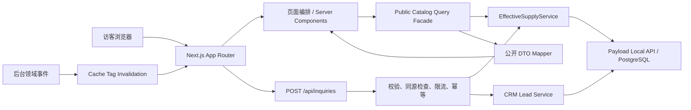

# 商办平台前台 MVP 技术设计

> 状态：待确认  
> 阶段：Spec Workflow Phase 2 — Design  
> 上游需求：[`requirements.md`](./requirements.md)  
> 页面 PRD：[`../../docs/prd/前台网站_MVP_页面PRD/README.md`](../../docs/prd/前台网站_MVP_页面PRD/README.md)  
> 后台基线：[`../backend-mvp/design.md`](../backend-mvp/design.md)、[`../backend-mvp/tasks.md`](../backend-mvp/tasks.md)  
> 适用代码：`payload-office-platform/src/app/(frontend)`  
> 更新日期：2026-07-25

## 1. 设计目标

本设计把已确认的前台 PRD 落成可实施的系统结构，重点解决四个问题：

1. 用统一有效供给服务保障首页、搜索、详情、楼盘聚合、相关推荐、询盘校验和 sitemap 口径一致。
2. 用稳定的公开 DTO 隔离 Payload 内部文档，避免组件直接读取后台字段和敏感关系。
3. 建立兼具“找房效率、楼盘数据深度和专业服务质感”的响应式页面系统。
4. 让 SEO、性能、可访问性、隐私与分析能力从第一版即具备可验收边界。

本阶段只定义方案，不修改业务代码和数据库结构。

## 2. 当前实现基线与差距

现有前台已经具备首页、房源搜索、房源详情、楼盘详情和询盘提交的最小闭环，但不作为目标架构直接延续。

| 现状 | 风险 | 本设计处理 |
|---|---|---|
| `queries.ts` 直接以旧 `status=available` 查询 | 绕过审核、发布、冻结、举报、媒体、区域及商户资格 | 所有公开查询只调用 `EffectiveSupplyService` |
| 详情按 slug 直接读取 | 已失效房源仍可能通过直链访问 | 请求时再次执行有效供给判定，不满足即 404/410 策略 |
| React 组件直接接收 Payload 文档并大量使用 `any` | 字段泄露、类型脆弱、难以缓存 | 查询层映射成只读公开 DTO，组件不得接收原始文档 |
| 询盘仅验证手机号并使用进程内限流 | 多实例失效、重复线索、上下文不足 | 持久化幂等、共享限流、隐私同意、来源上下文 |
| 全站 `force-dynamic` | 性能与 SEO 缓存能力不足 | 公共读页面使用带标签缓存和事件失效 |
| 文案出现乱码 | 核心流程不可用 | UTF-8 清理列为 P0 验收项 |
| 当前样式为居中卡片网格 | 缺少品牌层次、信息密度和决策支撑 | 实施已确认的编辑型专业服务视觉系统 |

## 3. 总体架构



### 3.1 分层职责

#### 路由层

- 负责解析 URL、生成 Metadata、选择 404/错误/空状态。
- 不拼装 Payload `where`，不解释后台状态枚举。
- Server Component 只消费公开查询门面返回的 DTO。

#### 公开查询门面

建议目录：`src/domain/public-catalog/`。

- `search-listings.ts`
- `get-listing-detail.ts`
- `get-building-detail.ts`
- `get-homepage.ts`
- `get-search-facets.ts`
- `get-public-pages.ts`
- `mappers/`
- `contracts.ts`

门面负责组合有效供给结果、稳定排序、公开字段投影、分页和缓存标签。

#### 统一有效供给服务

唯一实现位于 `src/domain/supply/`，由后台 M4.7 交付。前台不得复制或删减谓词。

服务至少提供：

- `searchEffectiveListings(input, context)`
- `getEffectiveListingBySlug(slug, context)`
- `listEffectiveListingsByBuilding(buildingId, input, context)`
- `getEffectiveListingFacets(input, context)`
- `assertEffectiveListing(listingId, context)`

`context` 必须包含 `asOf`、时区 `Asia/Shanghai`、公开渠道标识和可选城市。所有子查询在同一逻辑时点解析。

#### DTO 映射层

- 只暴露前台确实使用的字段。
- 媒体统一映射为 `{ src, width, height, alt, blurDataURL? }`。
- 富文本在服务端经过白名单渲染，不向浏览器下发后台关系和内部状态。
- 电话、经纪人内部信息、商户资质、审核/举报详情、坐标精度等字段默认不公开。

#### 客户端交互层

只用于筛选抽屉、图片浏览、询盘弹层、分享和轻量交互。数据首屏由服务端输出；不引入全局客户端状态库作为 MVP 前提。

## 4. 路由与页面结构

| 路由 | 渲染策略 | 主要数据 | 核心转化 |
|---|---|---|---|
| `/` | 缓存 RSC | 城市、精选有效房源、热门区域、服务内容、运营 Page | 搜索、进入精选、咨询 |
| `/listings` | RSC + URL 筛选 | 有效房源、facet、总数、分页 | 比较、打开详情 |
| `/listings/[slug]` | RSC + 请求时有效性复核 | 当前发布版本、楼盘摘要、同楼盘/相似有效房源 | 询价、预约 |
| `/buildings/[slug]` | RSC + 有效供给聚合 | 楼盘公开内容、有效房源、租金/面积区间 | 筛选楼内房源、咨询 |
| `/pages/[slug]` | 缓存 RSC | Payload Pages 已发布版本 | 内容阅读、引导咨询 |
| `/api/inquiries` | 动态 Route Handler | 询盘载荷、有效房源校验、线索服务 | 创建且只创建一次线索 |
| `/sitemap.xml` | 定时缓存 + 事件失效 | 可索引页面与有效供给 | 搜索收录 |

MVP 保留现有英文路径，避免上线前无必要的重定向与 SEO 迁移。中文导航名称不改变 URL。

## 5. 页面信息架构

### 5.1 全局框架

- 顶部：品牌、城市选择、找办公室、楼盘库、办公解决方案、关于我们、主咨询按钮。
- 移动端：紧凑顶栏 + 全屏菜单；房源详情底部固定咨询操作区。
- 页脚：城市与热门区域、产品入口、服务说明、公司及隐私条款、备案信息。
- 面包屑：房源详情、楼盘详情和内容页提供语义化路径。

### 5.2 首页

1. 品牌主张与直接可操作的找房搜索。
2. 精选房源，展示明确价格单位、面积、区域、楼盘和类型。
3. 热门区域/商圈，展示真实有效供给数量。
4. 服务能力，以顾问、选址、带看、谈判和入驻支持表达专业度。
5. 精选楼盘或城市办公指南。
6. 收束式咨询模块。

首屏不使用轮播，不以自动播放视频阻挡搜索任务。

### 5.3 房源搜索页

桌面采用“筛选与结果并重”的双层结构：

- 首行：关键词、城市/行政区/商圈、类型、面积、租金。
- 次行：地铁、装修、可入驻时间、更多筛选、排序、已选条件。
- 结果头：总数、当前区域说明、排序。
- 内容：3 列卡片；中等屏 2 列；移动端 1 列。

所有筛选状态编码进 URL；刷新、分享、前进后退均可复现。无结果时保留筛选并提供清除部分条件与提交需求，不伪造推荐数量。

### 5.4 房源详情页

桌面采用 8/4 栅格：

- 左侧：图片画廊、核心参数、房源说明、楼盘摘要、位置交通、同楼盘及相似房源。
- 右侧：粘性决策卡，包含标准化租金、面积、可入驻时间、咨询入口与隐私提示。

移动端为单列，价格与核心参数置于图片后，底部固定“询价 / 预约看房”。房源失效后不展示历史详情或表单。

### 5.5 楼盘详情页

- 楼盘视觉与摘要。
- 地址、行政区、商圈、地铁、等级和配套。
- 当前有效供给聚合：房源数、面积区间、按相同单位分组的租金区间。
- 楼内房源筛选列表。
- 编辑型楼盘介绍和咨询入口。

不同币种、租售类型或租赁单位不得合并成一个价格区间。

## 6. 视觉设计系统

### 6.1 设计方向

关键词：克制、专业、温暖、数据可信、编辑感。视觉质量目标接近成熟商业设计系统，但不在前台复刻 Arco/Ant 后台式组件外观。

### 6.2 颜色

| Token | 值 | 用途 |
|---|---:|---|
| `--color-ink` | `#171A1D` | 主文字、深色区块 |
| `--color-paper` | `#F5F1E8` | 品牌浅底 |
| `--color-canvas` | `#FCFBF8` | 页面背景 |
| `--color-line` | `#D5D0C7` | 分隔、输入边界 |
| `--color-copper` | `#A46F3F` | 主强调、关键 CTA |
| `--color-forest` | `#1F5A50` | 状态、辅助强调 |
| `--color-danger` | `#B0443C` | 错误 |

正文与背景对比度满足 WCAG AA；铜色不直接承担小字号正文。

### 6.3 字体与排版

- 中文展示：思源宋体 SC，按需子集化；不可用时回退宋体栈。
- 中文正文/界面：思源黑体 SC，回退系统无衬线。
- 数字与英文：IBM Plex Sans。
- H1 使用流体字号 `clamp(2.25rem, 5vw, 5rem)`；正文最小 16px。
- 金额数字使用等宽数字特性，单位始终和数值同屏。

### 6.4 栅格、间距与形状

- 最大内容宽度 1440px；桌面 12 列，左右留白 32–64px。
- 断点参考：`<640`、`640–1023`、`1024–1439`、`>=1440`。
- 4px 基础间距，主要节奏为 8/12/16/24/32/48/72/96。
- 卡片圆角 8–12px，避免大面积胶囊化。
- 阴影仅用于浮层和悬停；主体层级优先用留白、色块和边界表达。

### 6.5 图片与动效

- 房源卡片统一 4:3；详情主图桌面 16:10，使用 `next/image`。
- 后台媒体 alt 优先；缺失时由“楼盘名 + 空间类型”生成可读替代文本。
- 动效时长 160–240ms，尊重 `prefers-reduced-motion`。
- 不使用自动轮播、视差滚动和仅靠悬停才能发现的核心操作。

## 7. 公开数据契约

### 7.1 查询输入

```ts
type ListingSearchInput = Readonly<{
  city?: string
  district?: readonly string[]
  businessArea?: readonly string[]
  metro?: readonly string[]
  listingType?: readonly string[]
  areaMin?: number
  areaMax?: number
  rentMin?: number
  rentMax?: number
  rentUnit?: 'rmb-sqm-day' | 'rmb-month' | 'rmb-seat-month'
  availableBefore?: string
  q?: string
  sort?: 'recommended' | 'rent-asc' | 'rent-desc' | 'newest'
  page: number
  pageSize: 24
}>
```

解析器接收 `unknown`/`URLSearchParams`，对数组长度、数值边界、日期、枚举和页码做白名单校验。非法参数回退到安全默认值并生成规范化 canonical URL。

### 7.2 卡片 DTO

`ListingCardViewModel` 仅包含：

- `id`、`slug`、`title`
- 标准化 `price`（数值、币种、单位、可读文本）
- `area`、`listingType`、`availableFrom`
- 楼盘名、行政区、商圈
- 一张公开封面
- 最多三个公开亮点
- 推荐标识及稳定排序键

### 7.3 详情 DTO

在卡片字段基础上增加公开画廊、房源说明、工位数、楼盘摘要、位置交通、配套、SEO，以及已经过同一有效供给服务筛选的相关推荐。

组件不得通过 DTO 推断审核、举报、商户资格和内部经纪人信息。

### 7.4 稳定排序

- 推荐：运营推荐权重降序 → `last_effective_maintained_at` 降序 → `listing_id` 升序。
- 最新：`last_effective_maintained_at` 降序 → `listing_id` 升序。
- 价格：按同币种、同单位的标准字段排序 → `listing_id` 升序。
- 聚合、列表和分页使用同一 `asOf` 语义；同权重必须以不可变 `listing_id` 收束。

## 8. 统一有效供给集成

公开房源必须同时满足后台定义的完整谓词：

- Listing 未逻辑删除；
- 当前发布版本已上架，审核通过；
- `supply_visibility_hold=正常`；
- 未被有效举报暂停；
- 媒体完整，MVP 至少 3 张有效图片；
- Building、所属城市和区域均启用；
- 当前 Listing—Merchant 关系在 `asOf` 时点有效且唯一；
- Merchant 启用、资质有效且未过期；
- 已启用的商户服务城市覆盖 Building 城市；
- 租赁房源还需可租且可用日期未结束；
- `last_effective_maintained_at` 不满足陈旧规则的排除条件。

首页、facet 数量、结果总数、详情、同楼盘房源、相似房源、楼盘聚合、询盘候选和 sitemap 必须复用服务，不允许各自拼装条件。

M4.7 完成前，前台仅可在开发环境展示 fixture 或明确的“数据能力未就绪”状态；不得用旧 `status=available` 作为生产兼容降级。

## 9. 缓存与失效

### 9.1 策略

- 首页、列表、详情、楼盘与内容页使用 Next 数据缓存。
- 公共供给结果最长缓存 5 分钟。
- 详情请求在输出前必须校验当前有效性；失效事件目标 60 秒内清除相关缓存。
- 询盘接口和用户提交结果不缓存。

### 9.2 Tag 设计

- `public:home:{city}`
- `public:listings:{queryHash}`
- `public:listing:{listingId}`
- `public:building:{buildingId}`
- `public:facets:{city}`
- `public:page:{slug}`
- `public:sitemap`

Listing 发布/审核/冻结/举报/媒体/可用性变化，Building/区域状态变化，商户关系/资格/服务城市变化时，由领域事件解析受影响实体并失效对应 tag。若不能安全计算影响范围，失效城市级列表、facet 与 sitemap，不延长陈旧窗口。

## 10. 询盘链路

### 10.1 请求契约

```ts
type InquiryRequest = Readonly<{
  requestId: string
  name: string
  phone: string
  company?: string
  message?: string
  listingSlug?: string
  buildingSlug?: string
  demand?: {
    district?: string
    budget?: string
    area?: string
    moveInTime?: string
  }
  consent: {
    accepted: true
    policyVersion: string
  }
  source: {
    pageType: 'home' | 'search' | 'listing' | 'building' | 'content'
    path: string
    campaign?: Readonly<Record<string, string>>
  }
}>
```

### 10.2 处理顺序

1. 校验 Content-Type、body 大小、同源/CSRF 策略。
2. 将输入视为 `unknown`，用 schema 白名单校验并标准化手机号。
3. 校验隐私同意版本。
4. 以 `requestId + normalizedPhone + target` 计算幂等键。
5. 使用共享存储执行限流；IP 只保存带轮换盐的哈希。
6. 若带房源，调用 `assertEffectiveListing`；失效时返回中性提示并允许转为通用选址需求。
7. 事务性创建或返回已有 Lead，记录来源、落地页和目标对象。
8. 返回固定形状，不暴露线索 ID、内部错误或房源失效原因。

生产环境不得使用进程内 `Map` 作为唯一限流。幂等键需数据库唯一约束；重复请求返回同一成功语义。日志必须屏蔽完整手机号、姓名和留言正文。

## 11. SEO 设计

- 每个公开页面生成唯一 title、description、canonical 和 Open Graph。
- 房源与楼盘 JSON-LD 使用与页面相同的 DTO，不声明无法保证的价格或库存。
- 列表筛选页默认 canonical 指向规范化查询；低价值组合可 `noindex,follow`。
- sitemap 仅包含公开内容和当前有效供给，按 50,000 条拆分并支持增量。
- 失效房源从 sitemap 撤销；永久移除且无替代内容返回 410 的能力留作上线后策略，MVP 统一 404。
- 图片提供尺寸和 alt，避免 CLS；中文标题不可出现乱码或占位符。

## 12. 分析与隐私

### 12.1 事件

- `home_search_submit`
- `listing_filter_change`
- `listing_result_view`
- `listing_card_click`
- `listing_gallery_view`
- `inquiry_open`
- `inquiry_submit`
- `inquiry_success`
- `inquiry_error`
- `building_listing_click`

事件只记录枚举、对象匿名 ID、页面上下文和结果，不记录姓名、手机号、留言正文或完整 URL 查询中的个人信息。曝光事件使用可见性阈值并去重。

### 12.2 隐私

- 表单附近展示明确的收集目的和隐私政策链接。
- 未同意不得提交。
- 客户端错误监控在发送前清洗表单值。
- UTM 白名单化并限制键值长度。

## 13. 状态与错误处理

| 场景 | 用户表现 | 系统行为 |
|---|---|---|
| 首屏数据失败 | 完整错误卡与重试，不显示 0 套 | 记录 request ID，不泄露内部错误 |
| 搜索无结果 | 保留条件、建议放宽、提供需求提交 | `total=0`，不混入无关房源 |
| 图片失败 | 固定比例占位和文字替代 | 不阻塞详情与咨询 |
| 房源访问时失效 | 404 页面，推荐返回搜索 | 不渲染旧缓存内容 |
| 询盘重复 | 与首次成功一致 | 幂等返回，不重复建 Lead |
| 询盘限流 | 温和提示稍后重试 | `429` + 合理 `Retry-After` |
| Payload 暂时不可用 | 错误边界与重试 | 不退回绕过谓词的旧数据 |

## 14. 性能与可访问性

### 14.1 性能预算

- 移动端 p75：LCP ≤ 2.5s、INP ≤ 200ms、CLS ≤ 0.1。
- 首页首屏关键图片设置优先级，其余懒加载。
- 客户端 JavaScript 初始目标 ≤ 170KB gzip，不把 Payload 管理端依赖带入前台。
- 字体子集化并预加载必要字重，最多两个首屏字体文件。
- 搜索查询只选择 DTO 必需字段，避免高 depth 和 N+1。

### 14.2 可访问性

- WCAG 2.2 AA 作为验收目标。
- 全键盘可完成筛选、查看画廊、打开/关闭弹层与提交询盘。
- 弹层包含焦点锁定、Esc 关闭、焦点归还和背景不可操作。
- 筛选项、错误与结果数量使用可读 label 和适当 live region。
- 触控目标不小于 44×44px；颜色不作为唯一状态信息。

## 15. 测试与验证

### 15.1 单元测试

- URL 筛选解析、规范化和边界。
- DTO mapper 不泄露内部字段。
- 金额/面积/日期格式化和单位不可混算。
- 稳定排序与分页。
- 询盘 schema、手机号标准化、幂等键。

### 15.2 领域契约测试

以后台 fixture 覆盖有效、草稿、审核未通过、冻结、举报暂停、媒体不足、Building/区域停用、商户停用/过期、服务城市不覆盖、关系重叠、陈旧房源。对每组数据断言：

- 首页、列表、总数、facet、详情、楼盘聚合、相关推荐、询盘候选和 sitemap 结果一致。
- 任一条件失效后均不出现“列表隐藏但直链可见”的差异。

### 15.3 集成与 E2E

- 首页搜索 → 筛选 → 房源详情 → 询盘成功。
- 移动端筛选抽屉和固定 CTA。
- 无结果、404、接口失败、重复提交、限流。
- canonical、metadata、JSON-LD、sitemap。
- 键盘流程、焦点、对比度、减少动效。

### 15.4 浏览器设计走查

在 375×812、768×1024、1440×900、1920×1080 四个视口逐页检查：

- 信息层级、文字换行、价格单位、图片裁切。
- 吸顶栏、筛选、弹层和固定 CTA 是否遮挡内容。
- 空/错/加载/长文本/极值价格状态。
- 中文字符编码和字体回退。

## 16. 实施顺序与依赖

| 阶段 | 内容 | 阻塞依赖 |
|---|---|---|
| F0 | UTF-8 修复、类型与测试基线、公开 DTO 契约 | 无 |
| F1 | 接入 M4.7 统一有效供给服务与契约测试 | 后台 M4.7 |
| F2 | 页面外壳、视觉 token、导航、页脚、响应式基础 | F0 |
| F3 | 搜索、facet、列表卡片、URL 状态 | F1、F2 |
| F4 | 房源详情、楼盘详情、相关供给 | F1、F2 |
| F5 | 询盘安全链路和 CRM 上下文 | 后台 M5 / Lead 字段与幂等约束 |
| F6 | Pages、SEO、sitemap、缓存事件失效 | F1、后台事件 |
| F7 | 分析、性能、可访问性、跨浏览器设计走查 | F3–F6 |

F2 可与后台 M4 并行，但任何生产公开数据能力必须等待 F1。

## 17. 迁移策略

1. 先新增公开查询门面与 DTO，不直接改页面视觉。
2. 为旧查询建立调用清单，逐路由迁移后删除 `buildListingWhere` 等旧口径。
3. 以功能开关在测试环境切换新前台；开关不得切回不安全旧数据源。
4. 先迁首页/列表，再迁详情/楼盘，最后迁 sitemap 与询盘。
5. 完成统一契约测试后删除所有组件内 `any` 和原始 Payload 文档输入。
6. 上线前以生产等价数据执行有效供给差异报告，差异必须解释为 0 或已批准的数据修复。

## 18. 需求追踪

| 需求 | 设计落点 |
|---|---|
| R1 全局导航与品牌框架 | §5.1、§6 |
| R2 首页找房与服务表达 | §5.2 |
| R3 房源搜索与筛选 | §5.3、§7.1 |
| R4 房源卡片与结果状态 | §5.3、§7.2、§13 |
| R5 房源详情与转化 | §5.4、§7.3 |
| R6 楼盘详情与供给聚合 | §5.5、§7.4 |
| R7 询盘闭环 | §10 |
| R8 内容页面与 SEO | §4、§11 |
| R9 统一有效供给 | §3.1、§8、§9 |
| R10 非功能、隐私与分析 | §9、§12–§15 |

## 19. 已定决策

- 首发按单城市体验设计，数据模型和 URL 保留多城市扩展位。
- 默认以租赁场景为主；出售房源必须与租赁分开筛选、计价和聚合。
- 首页精选优先使用后台推荐权重，不建立前台独立推荐状态。
- 房源失效 MVP 使用 404；不展示历史价格和已失效详情。
- 表单采用页面弹层/抽屉，不跳转独立落地页；提交后留在当前决策上下文。
- 不使用地图作为 MVP 核心浏览方式，保留后续地图搜索扩展位。
- 视觉实现采用项目原生 CSS/设计 token 与必要的无障碍交互原语，不引入 shadcn-ui。

## 20. 进入任务拆分前的确认

确认本设计后进入 Spec Workflow Phase 3，生成 `specs/frontend-mvp/tasks.md`。任务将按 F0–F7 拆分，并明确每项的修改文件、依赖、测试和浏览器验收标准。
